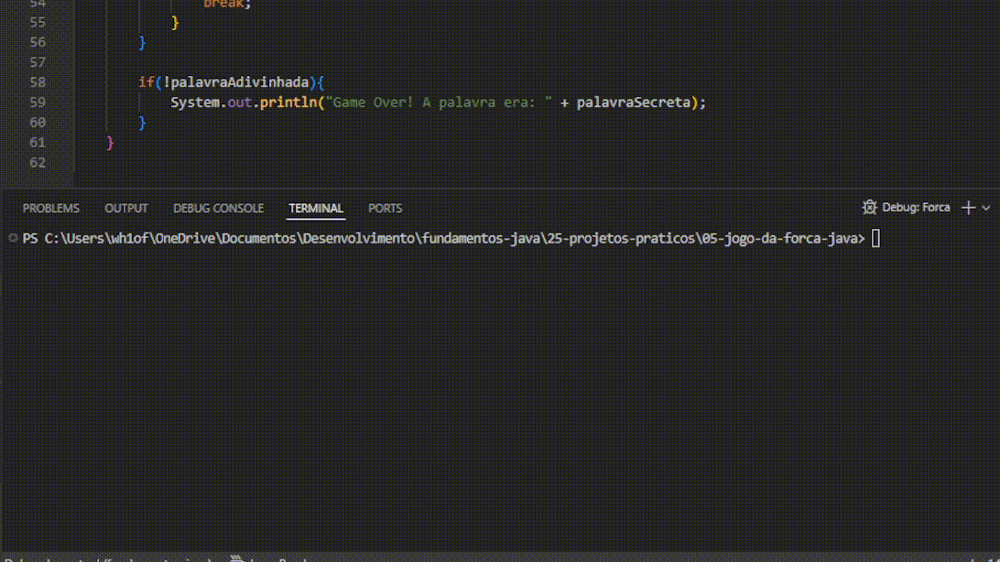

# Jogo da Forca em Java

Jogo da forca executado no terminal, criado para praticar lógica de programação, manipulação de texto, coleções e controle de estado em Java.



## Repositório

[jogo-da-forca](https://github.com/p-rcorreia/jogo-da-forca.git)

## Objetivo

Criar uma versão funcional do jogo da forca, com seleção aleatória de palavra secreta, leitura de chutes pelo terminal e verificação de vitória ou derrota.

## Conceitos praticados

- `ArrayList`
- `Random`
- `Scanner`
- `StringBuilder`
- Estruturas condicionais
- Loops `while` e `for`
- Métodos de texto como `contains`, `charAt` e `replace`
- Atualização de caracteres com `setCharAt`
- Controle de estado com `boolean`

## Funcionalidades

- Seleciona uma palavra secreta aleatoriamente.
- Exibe a palavra oculta com traços.
- Permite chutar letras pelo terminal.
- Atualiza a palavra exibida quando a letra existe.
- Informa a quantidade de tentativas restantes quando a letra está incorreta.
- Finaliza o jogo com mensagem de vitória ou derrota.

## Como executar

Na pasta do projeto:

```powershell
javac Forca.java
java Forca
```

## Status

Concluído.
